# 🎬 Watchly

A user-friendly Movie Portal to simplify the process of exploring movies, viewing movie details, adding movies, and deleting movies while managing user favorites. This project has a dynamic user interface, robust functionality, and seamless user experience.

## Features
- **User Authentication**: Secure login and registration system.
- **Movie Management**: Add, view, and delete movies.
- **Favorites**: Users can mark movies as favorites for easy access.
- **Responsive Design**: Optimized for both desktop and mobile devices.

## Technologies Used
- **Frontend**: React, Tailwind CSS, DaisyUI
- **Backend**: Node.js, Express.js
- **Database**: MongoDB
- **Authentication**: Firebase Authentication
- **Deployment**: Firebase for frontend, Vercel for backend
- **Version Control**: Git, GitHub

## Registration Page

A modern and responsive registration page built with React and Express, integrated with Firebase Authentication and MongoDB.

---

### 🧰 Tech Stack

- **react-icons**
- **react-spinners**
- **sweetalert2**
- **Express.js**
- **CORS**
- **MongoDB**
- **Firebase**

---

### 📸 Screenshots

### 💻 Desktop View  
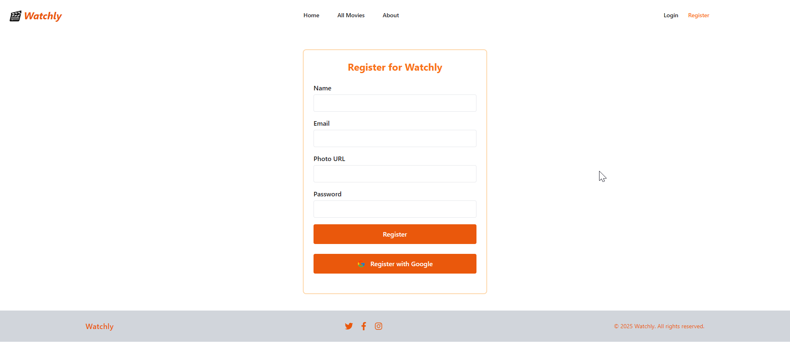

### 📱 Mobile View  
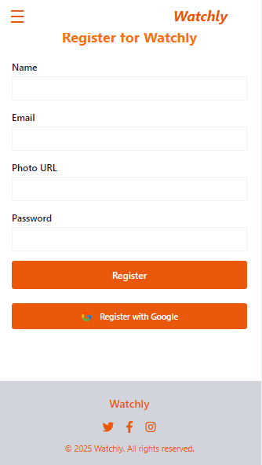

---
## Login Page
---
### 📸 Screenshots

### 💻 Desktop View  
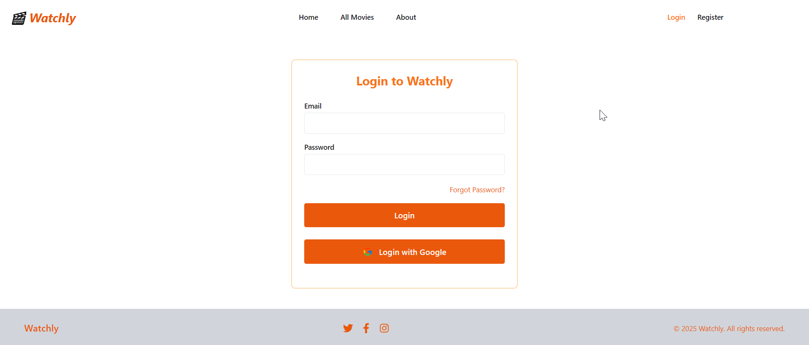

### 📱 Mobile View  
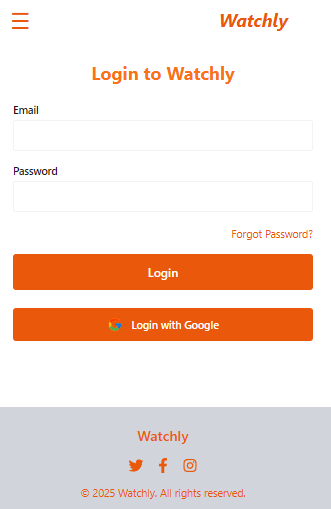

---
### Add Movie Page
A user-friendly interface for adding movies, built with React and integrated with MongoDB

### 📸 Screenshots
### 💻 Desktop View
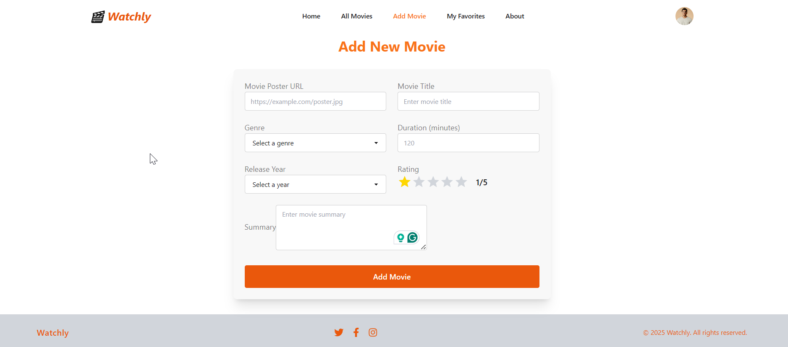
### 📱 Mobile View
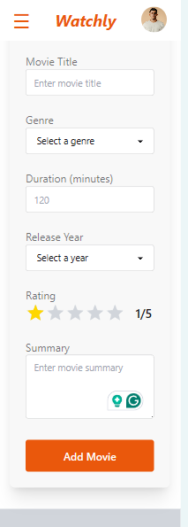
### MongoDB Schema View 
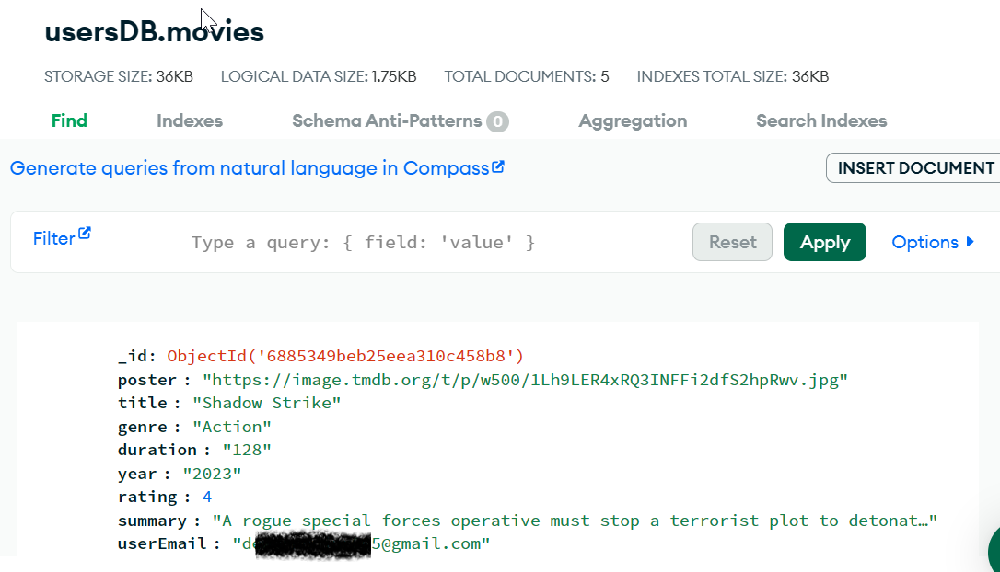

---
## All Movies Page
A comprehensive page displaying all movies, built with React and integrated with MongoDB.

### 📸 Screenshots
### 💻 Desktop View
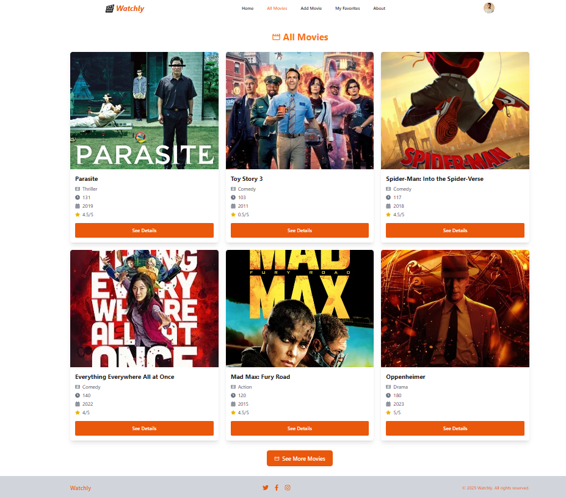
### 📱 Mobile View
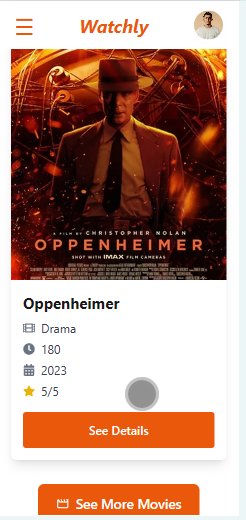
### MongoDB Schema View
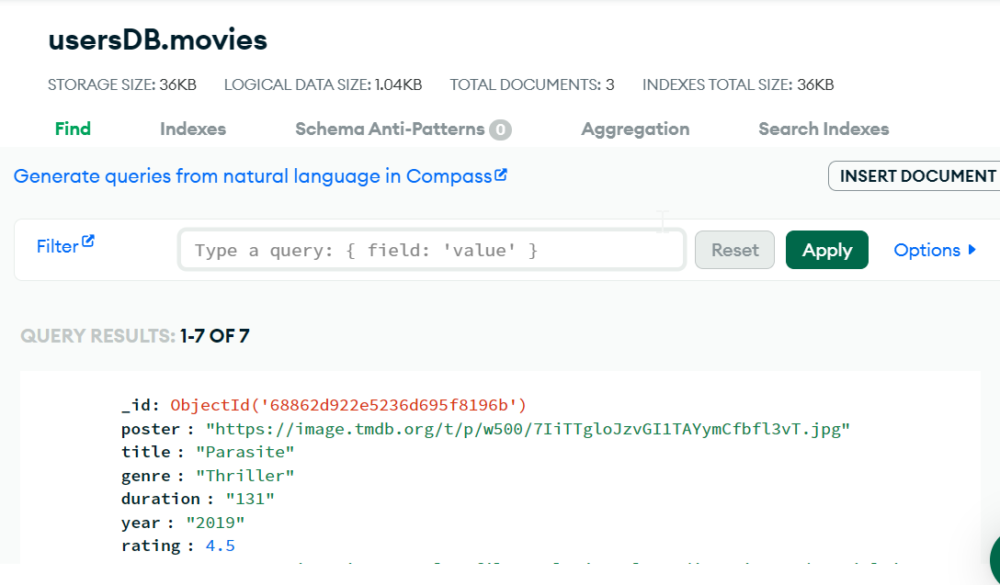

---
## Movie Details Page
A detailed view of each movie, built with React and integrated with MongoDB.
### 📸 Screenshots
### 💻 Desktop View
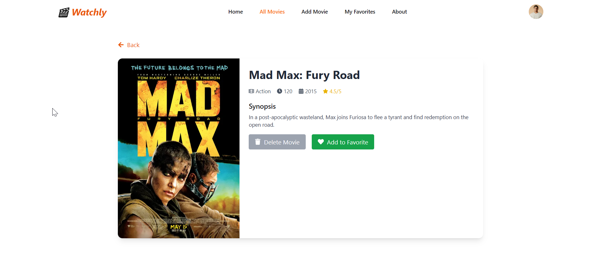
### 📱 Mobile View
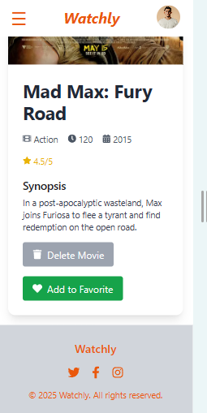

---
## Favorite Movies Page
A dedicated page for users to view their favorite movies, built with React and integrated with MongoDB
### 📸 Screenshots
### 💻 Desktop View
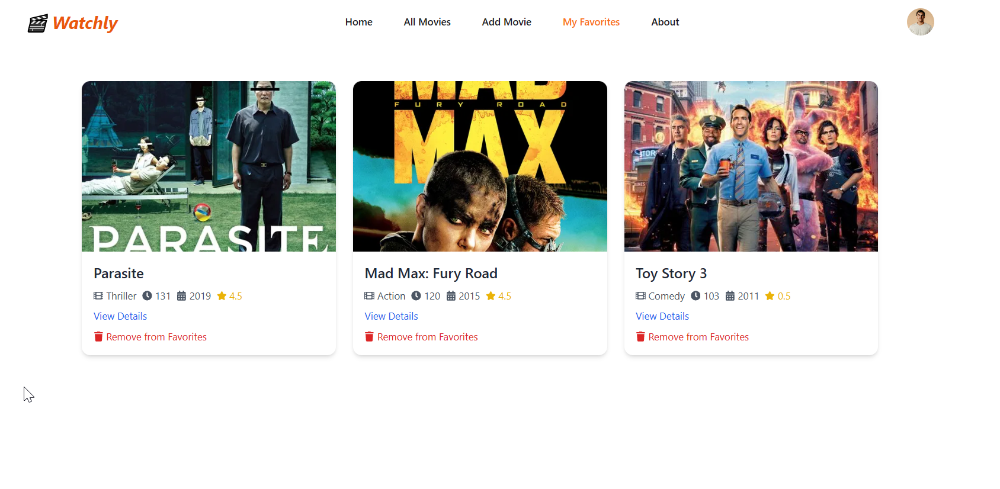
### 📱 Mobile View
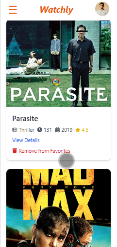
### MongoDB Schema View
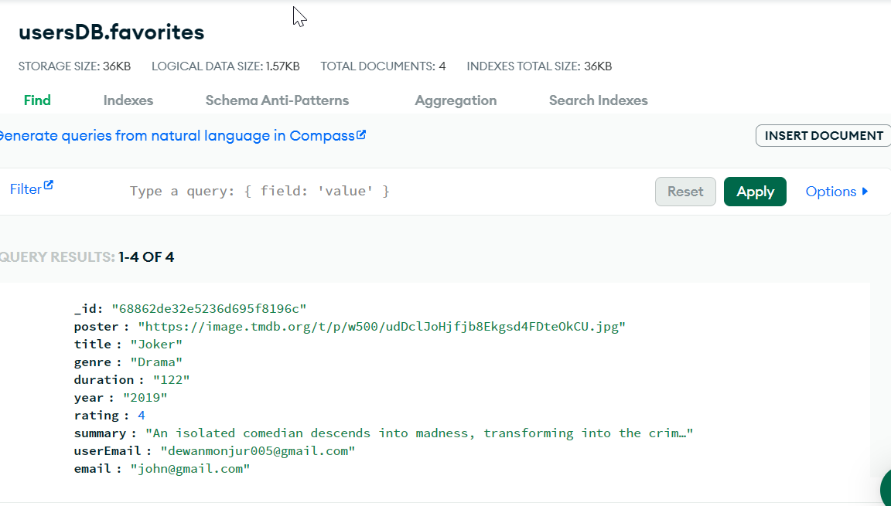

---
## About Page
A simple about page providing information about the Watchly project
### 📸 Screenshots
### 💻 Desktop View

### 📱 Mobile View
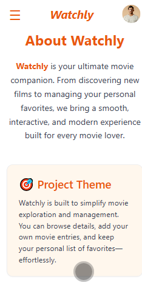

---
## Home Page
there are 5 sections in the home page
1. Sliders
2. Featured Movies Based on Top Rating
3. Latest Releases Based on Year
4. Top Contributors
5. Why Choose Us
### 📸 Screenshots
### 💻 Desktop View
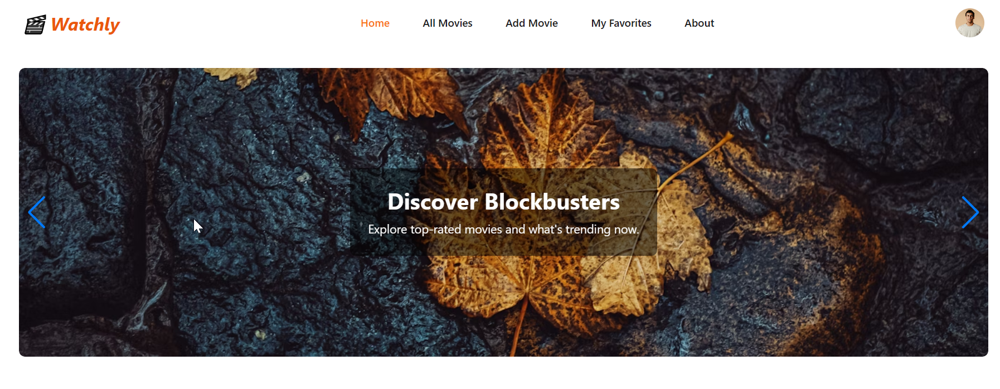
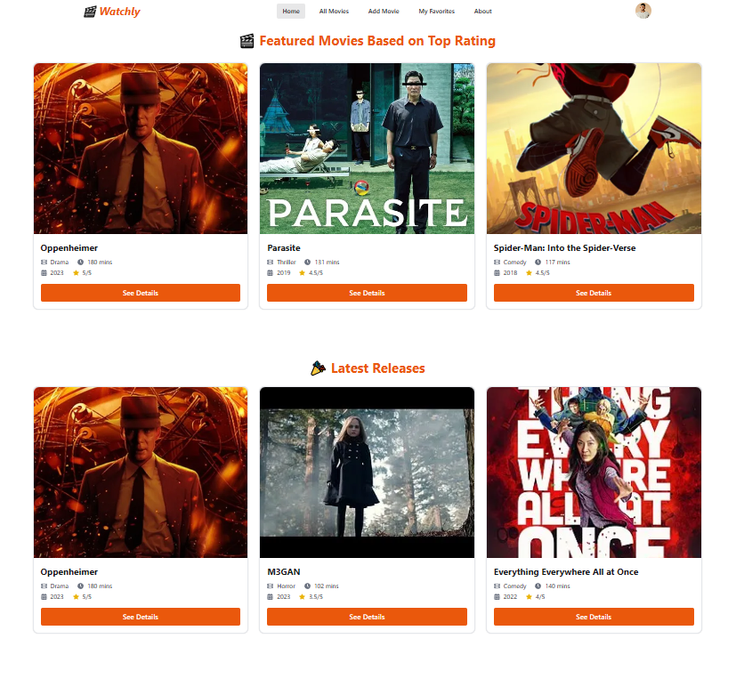
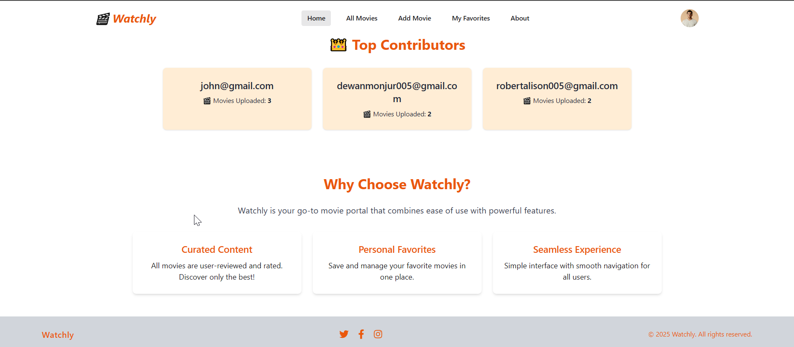
### 📱 Mobile View
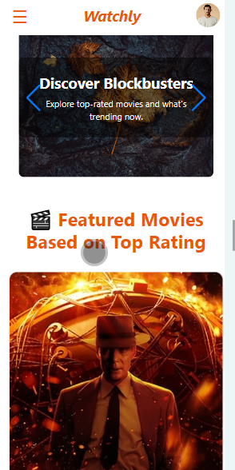
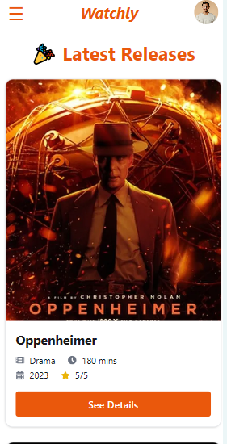
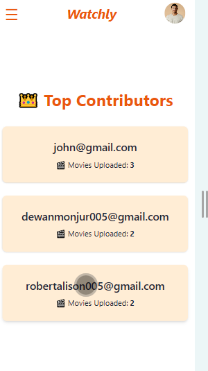
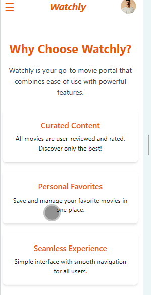
